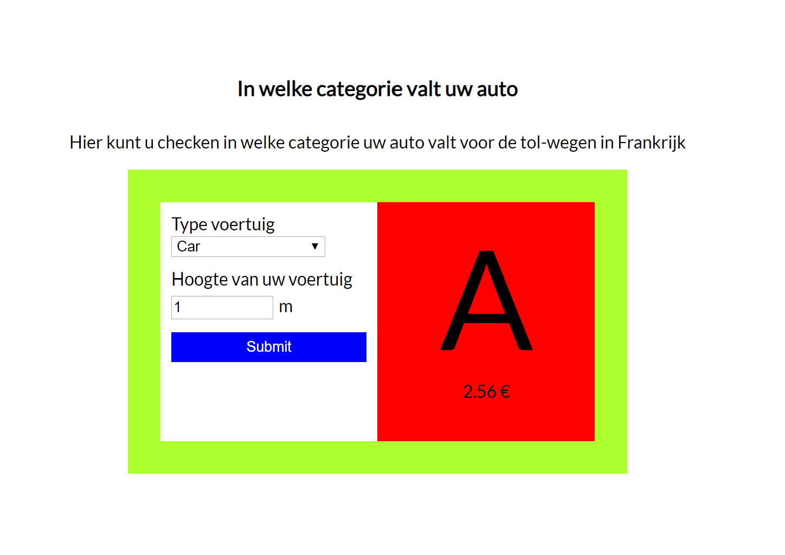

# Casustoets

- starttijd: 13.00 uur
- eindtijd: 16.00 uur
- hulpmiddelen: internet, huiswerk en voorbeelden uit les. Het is uitdrukkelijk verboden om sociale media in te zetten en contact te zoeken met anderen.
- eigenaarschap: de code die je hebt opgeleverd is door jou ontwikkeld.
- inleveren: lever via learn een .zip bestand in van al je bestanden.

## Casusomschrijving


Gegeven is de HTML en CSS (zie map start) van het bovenstaande plaatje. In dit plaatje worden type voertuig en hoogte ingevoerd. Vervolgens wordt er berekent in welke categorie het voertuig valt en wat de tol-prijs van het voertuig is. De categorie en prijs worden door JavaScipt naar het DOM geschreven. Wanneer de hoogte van het voertuig niet binnen de laatste categorie past moet er een foutmelding worden gegeven. De foutmelding komt te staan in de `div` met id `message`. De foutmelding is een `p` waaraan de css class `error` wordt toegevoegd en heeft de volgende inhoud 'Je voertuig is te hoog voor onze tolwegen!'.

De HTML en CSS voor deze opdracht is gegeven en staat in de map 'start'.

De categorieen van de auto staan opgenomen in de volgende array van objecten.

```
//global variables
const carCategories = [
    {
        category: 'A',
        minHeight: 0,
        maxHeight: 1.8,
        price: 2.56
    },
    {
        category: 'B',
        minHeight: 1.9,
        maxHeight: 3,
        price: 3.05
    },
    {
        category: 'C',
        minHeight: 3.1,
        maxHeight: 5,
        price: 5.67
    },
    {
        category: 'D',
        minHeight: 5.1,
        maxHeight: 8,
        price: 2.45
    },
];
```

## Nakijkcriteria

1. Je mag geen jQuery gebruiken, alleen native JavaScript. Wanneer er wel jQuery wordt gebruikt dan wordt de opdracht niet nagekeken.
2. Je applicatie wordt alleen nagekeken op het moment dat de waardes uit het invoervelden worden vergeleken met de categorien en er een bericht wordt geschreven naar de DOM.
3. Je kunt voor de 10 gaan door de opdracht volledig af te maken.

## Beoordelingscriteria

Nr | Leeropbrengsten | Punten
---|---|---
1 | Gebruikt consistente naamgeving | 5
2 | Gebruikt const, let, var in de gevraagde situatie | 5
3 | Gebruikt array's om data in op te slaan | 5
4 | Gebruikt een conditional (if else)| 10
5 | Gebruikt een loop om herhaling van stappen te voorkomen | 10
6 | Schrijft een functie om code te structureren | 10
7 | Schrijft een functie om herhaling te voorkomen | 5
8 | Schrijft commentaar volgens de JS docs richtlijnen | 5
9 | Gebruikt de juiste operatoren bij vergelijkingen | 5
10 | Gebruikt console.log om te debuggen | 5
11 | Gebruikt een object om gestructureerde data in op te slaan | 5
12 | Gebruikt Events voor interactie | 10
13 | Gebruikt DOM methods (interfaces) om HTML elementen te maken en te plaatsen in het DOM | 10
14 | Gebruikt DOM methods (interfaces) methoden om door de DOM te wandelen | 10

## Puntenverdeling

Beoordeling | Cijfer | Aantal punten
---|---|---
onvoldoende | 4 | < 60
matig | 5 | 60 tot 70
voldoende | 6 | 70 tot 80
ruim voldoende | 7 | 80 tot 85
goed | 8 | 85 - 90
zeer goed | 9 | 90 - 95
uitmuntend | 10 | 95 - 100